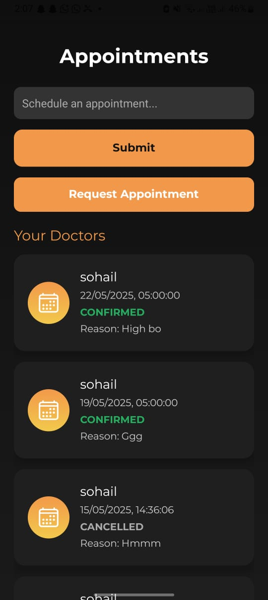
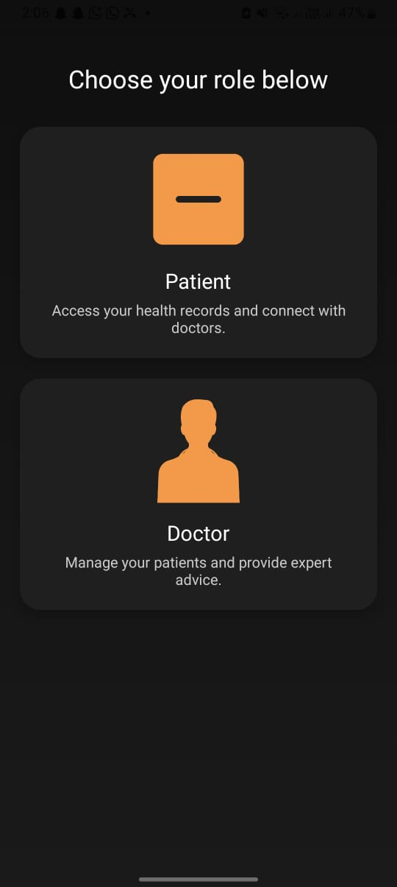
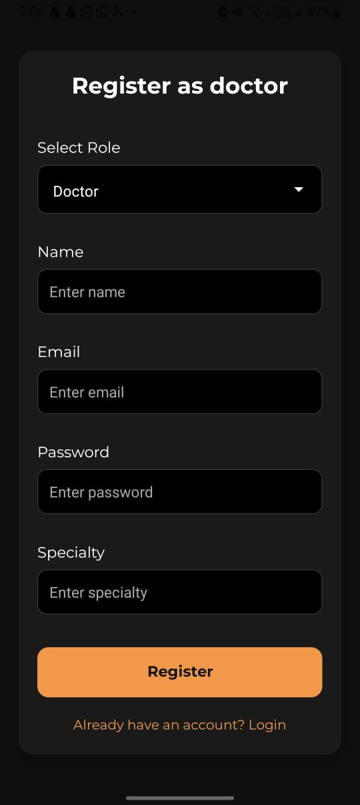
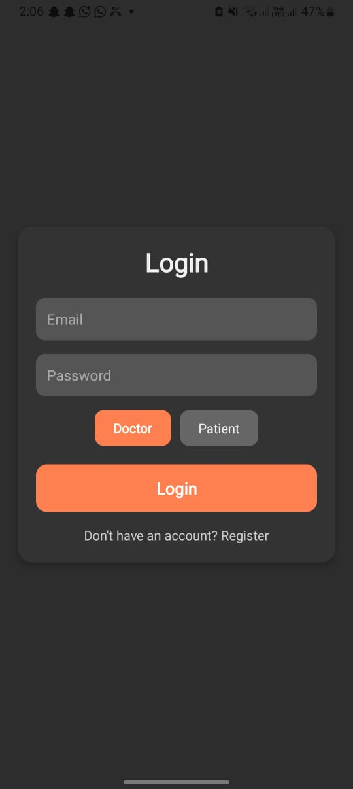
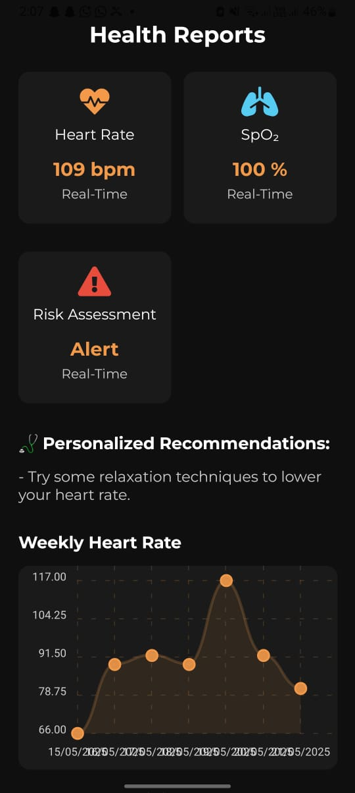

# 🩺 AI-Based Health Care App

This is a React Native mobile application with a Node.js/Express backend and MongoDB database. The system uses AI to monitor real-time patient health data and enables smart healthcare features like:

- 📊 Real-time Health Report Monitoring
- 👨‍⚕️ Patient–Doctor Assignment
- 🤖 AI-based Chatbot for health guidance
- 📅 Auto-generated Appointment Booking
- 🔐 Secure Role-based Login/Register (Doctor, Patient)
- 🧠 AI suggestions for medicine & consultation

## 📱 Screenshots

| Onboarding | Role Selection | Register | Login |
|-----------|----------------|----------|-------|
|  |  |  |  |

| Health Report | Appointment |
|---------------|-------------|
|  |  |

## 🛠 Tech Stack

- **Frontend:** React Native (Expo)
- **Backend:** Node.js + Express.js 
- **Database:** MongoDB (Mongoose)
- **AI & Features:**
  - Real-time patient data monitoring
  - AI chatbot (Router Ai)
  - Auto scheduling & recommendations

## 🔐 User Roles
- **Patient:** View health reports, get chatbot suggestions, book appointments
- **Doctor:** Monitor assigned patient data, view reports, accept/reject appointments

## 🚀 Getting Started

Clone the repo:
```bash
git clone https://github.com/your-username/your-repo-name.git
cd your-repo-name
npm install
npx expo start
//////////////////////////////////
Backend (Node.js)
->
cd backend
npm install
node index.js

🙋‍♂️ Author
Name: Ali Shan Pansota

Tech Stack: React Native, Express.js, MongoDB, AI Integration

linkedIn:  linkedin.com/in/ali-shan-pansota
Email: alishanpansot49@gmail.com

